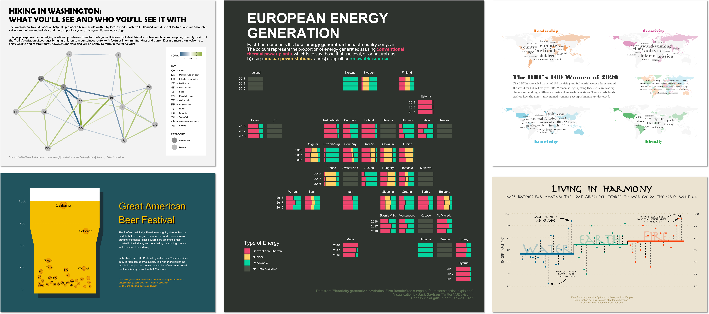

  
  
  
  
  

<h4 align="center">  
  🖱️ R Development | 📊 Data Visualisation | 🫁 Air Quality
</h4>

### :man_technologist: About Me

I am an air quality data analyst, R developer & instructor in Oxfordshire, United Kingdom.

- 👷‍♂️ Currently developing the <b>[openairmaps 🗺️](https://github.com/davidcarslaw/openairmaps)</b> and <b>[ggopenair 🎯](https://github.com/jack-davison/ggopenair)</b> R packages.
- 🤷‍♂️ Learning [Shiny](https://shiny.rstudio.com/)
- 👨‍🏫 [Rstudio Certified Tidyverse Instructor](https://education.rstudio.com/trainers/)
- 👨‍🎓 PhD in Atmospheric Chemistry from the [Wolfson Atmospheric Chemistry Laboratories](https://www.york.ac.uk/chemistry/research/wacl/), [University of York](https://www.york.ac.uk/)
- 🙋‍♂️ Reach me on [Twitter](https://twitter.com/JDavison_) - I'm [`@JDavison_`](https://twitter.com/JDavison_)

----

### 🤹‍♂️ Languages & Tools

   &nbsp;&nbsp;&nbsp;
  &nbsp;&nbsp;&nbsp;
  &nbsp;&nbsp;&nbsp;
  &nbsp;&nbsp;&nbsp;
  &nbsp;&nbsp;&nbsp;
  &nbsp;&nbsp;&nbsp;

---

### 🕺 Interests

- My key interests are in R package development, Shiny development, and data visualisation.

- I am interested in teaching R & reproducible data analysis, particularly to scientific & non-programmer audiences.

- I occasionally take part in [#TidyTuesday](https://github.com/rfordatascience/tidytuesday) - see some of my contributions below!

---

Computer icon by monkik from <a href="https://thenounproject.com/browse/icons/term/computer/" target="_blank" title="Computer Icons">Noun Project</a>
